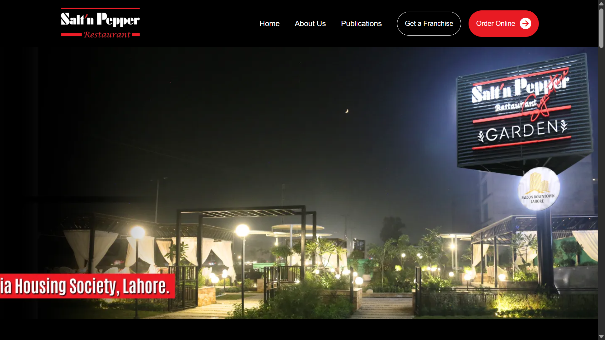

# Salt'n Pepper Website Clone


A front-end clone of the Salt'n Pepper restaurant website built using HTML and CSS as part of a web development course assignment.

---

## 🌐 Live Demo

👉 https://ahmedaalam.github.io/saltnpepper-webpage-clone/

---

## ✨ Features

* Restaurant website UI replica
* Clean and structured layout
* Static frontend design

---

## 🛠️ Tech Stack

* HTML
* CSS

---

## 📷 Screenshot

<p align="center">
  
</p>

---

## ⚙️ Project Setup

Clone the repository:

```bash id="5k6p4h"
git clone https://github.com/ahmedaalam/saltnpepper-webpage-clone.git
```

---

## 📌 Note

This project is a UI clone created for educational purposes only and is not affiliated with Salt'n Pepper.
